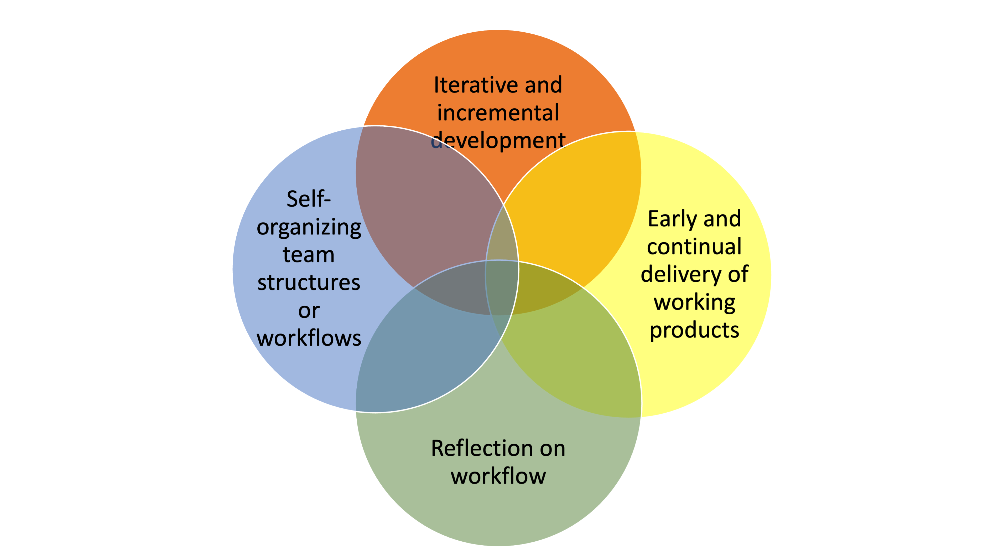
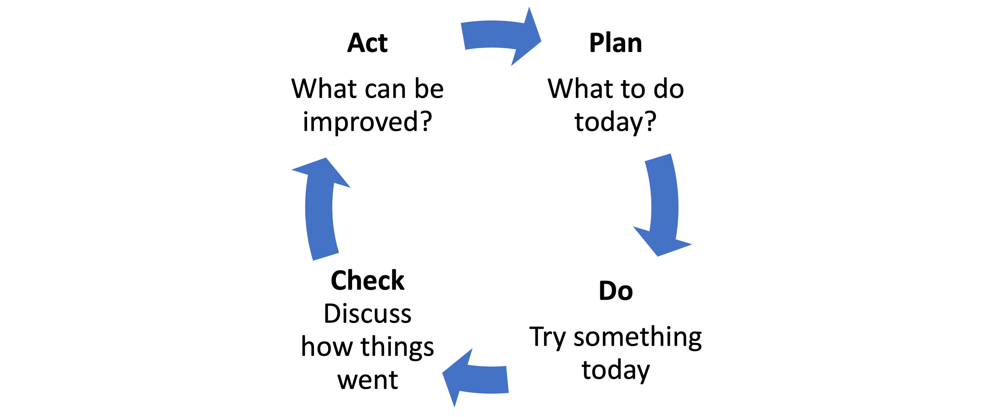

# Project Management

This tutorial will introduce you to some basic concept of project management and some general frameworks to help team collaboration during a hackweek.

```{admonition} Learning Objectives
- Introduce agile project management concepts
- Introduce the Learning Cycle (PDCA)
- Describe a basic daily check-in for teams
- Introduce the idea of a loose Kanban board for hackweek teams
```

```{important} Note
Keep in mind that learning and exploration is the primary goal for many participants and we don't want to get too task and goal focused. Nonetheless, implementing some features of structured team project management will help teams that are very diverse (in terms of skill sets, backgrounds and goals) work better together and makes the process more fun and engaging for everyone.
```

## Agile project management

Today agile methodologies are the norm in software development (in particular Scrum), but these methods not at all restricted to software development. Agile concepts are widely used in team-based project management. Agile methodologies are characterized by 4 key features:



```{image} ../img/projects/agile-elements.png
:alt: diagram of the 4 agile key principles
:class: bg-primary mb-1
:width: 450px
:align: center
```

Another feature of agile methods is that they use **lightweight** workflow **structures**. This means they rely on principles that pretty easy to apply and adapt to many different applications. 

## Foundational concepts

The term "Agile" (or "agile") is traced back to the [Agile Manifesto](https://agilemanifesto.org/) (4 statement and 12 principles) written at a 2001 gathering of software development "visionaries", but the 2 core ideas trace back much earlier to work on industrial quality control. These 2 core ideas are rapid iterative work-learn cycles (PDCA cycle) and radically open and individually empowered team culture ("Toyota Way"). 

### Plan-Do-Check-Act (PDCA) cycle



```{image} ../img/projects/PDCA.png
:alt: Plan-Do-Check-Act
:class: bg-primary mb-1
:width: 450px
:align: center
```

Rapid cycles of work following a plan, work (do), reflect (check), improve (act) cycles are at the heart of agile and many other modern project management frameworks. This is fundamentally different than the classic "waterfall" type project management where one makes a detailed plan (project proposal) ahead and then strives to carry out that plan to a T.

The PDCA cycle was popularized by **William Edwards Deming**<sup>1</sup> and his work on how to design workflow and organizational systems that improve quality control, though the ideas behind Demings work are traced back to the 1930-50s with work on industrial quality control systems by Walter A. Shewhart and even earlier ideas on the scientific method applied to industrial processes. 

The key idea here is that you incorporate explicit periods of planning and reflection on your strategy but you don't get too hung up on created plans that are more detailed than your current state of knowledge. You acknowledge that you don't know exactly what will the best strategy or even ideas. Note, PDCA cycles are used both when the end goal is known AND when it is not known. The latter situation is common; for example, if goal is to innovate but there are many different innovations that are of interest and you don't know what is promising or you are creating products that are user-driven and exposure of the user to your product changes their needs and desires. 

```{image} ../img/projects/PDCA-Multi-Loop.png
:alt: diagram of the purpose of hackweek project work
:class: bg-primary mb-1
:width: 450px
:align: center
```

### Group Activity: the Ball Game

A team cooperative activity using PDCA cycles.

**Goal:** Move 20 tennis balls as fast as possible through the team. At the start of a round, 20 balls are in the start bucket and 0 balls in the finish bucket. The round is done when all 20 balls are in the finish bucket.

**Rules:**

* The same person that takes a ball from the start bucket is the person that puts the ball in the finish bucket.
* Balls can only be touched by one person at a time.
* Each ball must be touched by each team member.
* Each ball must have air time.
* Balls cannot be passed to a person on your left or right shoulder.

**Rounds:**

* Begin with 2 minutes team planning
* Round 1. Start the balls. Stop when 20 balls are through.
* 1 minute of evaluation and planning.
* Repeat 4 more times.
* End with a de-brief.

### Open, Empowered and Empowering Team Culture

This has three synergistic components: radically open and transparent workflow, team culture that eschews hierarchy and encourages agency (choosing what you do), and a team culture that focuses on empowering team mates by teaching and sharing skills and creation with derivative value in mind (you create things with the idea that team mates will build on them).

A key idea is that certain team habits and structures organically create these components. For the purpose of the hackweek, we will focus on 3 simple daily team activities to help promote this.

The role of the team project facilitator is to run these daily activities and help the team solve logistical problems and get around road blocks.

### Promoting team collaborations

A feature of agile methods is using team "habits" that organically help promote the 4 key principles. For the hackweek, we will use the daily check-in and a team "Kanban" board. 

#### The daily check-in or "stand-up"

This is first thing in the morning before the tutorials. It is a strictly time-boxed activity of 15 minutes. Day 2-5.

Each participants states:

* What did I do yesterday?
* What will I do today?
* What are my blocks or barriers?

During the check-in, the team facilitator:

* Takes notes. Writes blocks on a flip-board.
* Checks statements against the team Kanban board. Encourages team members to add sticky notes to the team Kanban board.
* After check-in and while participants are in tutorials, discusses the blocks with other facilitators.
* Once group work begins in the afternoon works with members to help resolve blocks.

#### Team "Kanban" board

Kanban is in quotes because the board that we will use is not strictly speaking a Kanban board; we are using the board to allow the team to see what everyone is working on.

The should start with 4 columns and the team can change this around if needed as the week progresses.

* Ideas: Ideas that might be turned into tasks. This column will be pretty messy.
* Ready: A task or activity that is defined enough that someone can read it and do it. Note, it's fine and typical to write your own task cards.
* In progress: A task or activity that someone is working on.
* Ready for review: A task that is ready for someone else to take up. Write what needs to be done next.
* Done: Completed tasks.

## Roles

### Project Team Facilitator

The role of Project Facilitator assist the project lead, run the team daily check-ins, and help solve team member blocks. If you are familiar with Scrum, this person is vaguely playing the role of the "Scrum master". 

* Assist the project team lead
* Run initial activity to help each person get clear on their individual goals during the project work
* Set-up the Kanban board for each team and help the project team lead organize this (following the lead of the project lead)
* Running daily team check-in --- make sure it doesn't devolve into discussion. It is strictly time-boxed.
* facilitating relationship-building and development of collaborative structures among the team
* assist the project lead in helping team members find project work


### Project Team Lead

The role of Project Team Lead is to guide the collaborative project work before, during and sometimes after the hackweek. Specific tasks could include:

* pitching an idea for a project
* gathering together a team
* helping define tasks for the project that are within the scope of the hackweek  
* facilitating relationship-building and development of collaborative structures among the team
* helping team members find project work

### Project Helper

Each project might have one or several Project Helpers. Their role is often to:

* offer technical guidance on a specific data science tool or topic in which they have expertise
* help team members navigate collaboration technologies like JupyterHub and GitHub
* offer a deeper-dive on content touched on during tutorials
